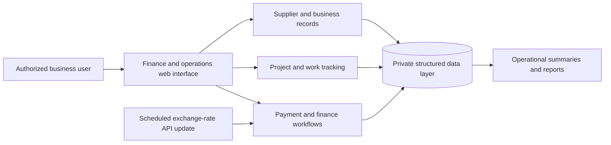

# AS Finance & Operations

A sanitized professional case study of finance, payment, project, and work-management software built for a real business environment.

> This is not the original production repository. Production company records are not included, and this public representation contains no real payments, suppliers, employees, customers, credentials, spreadsheets, PDFs, or Word documents. Any illustrative data added here must be synthetic.

**Status:** Sanitized documentation and architecture representation.  
**Source boundary:** Original application repositories and commercial history remain private.

## Context

The underlying work was created around practical company workflows: tracking payment obligations, connecting financial records to projects or work items, organizing supplier and business information, updating exchange-rate context, and producing usable operational views and reports.

Several iterations explored how to move spreadsheet-driven work into structured web software. The public case study focuses on the engineering lessons and system shape without reproducing company identity or records.

## Workflow Areas

- Payment and finance tracking
- Project and work-item tracking
- Supplier and business-record organization
- Spreadsheet/document migration into structured records
- Scheduled exchange-rate updates from an external API
- Filtering, summaries, and operational reporting
- Role-aware access and authenticated administrative workflows in later application work

## Representative Data Flow

This diagram is a sanitized representation. It intentionally abstracts the production company, record shapes, deployment configuration, and the different persistence approaches explored across private iterations.

## Engineering Considerations

### From spreadsheets to explicit records

The original workflow involved business documents and spreadsheets. Converting that work into software required defining stable entities, validation rules, relationships, and migration paths instead of treating the spreadsheet layout as the application model.

### Currency and time-dependent values

Exchange-rate context changes over time. Scheduled API updates were used to reduce manual maintenance while keeping finance views tied to explicit recorded values rather than hidden model assumptions.

### Operational reporting

The system was shaped around questions a business user needs to answer: what is due, which project or supplier a record belongs to, and what requires follow-up. Reporting is therefore part of the workflow rather than a separate decorative dashboard.

### Privacy before portfolio visibility

The original repositories contain commercial history and were deliberately kept private. A clean documentation repository is safer and more accurate than copying production history, documents, or fake replacement code into a public portfolio.

## Technology Evidence

The private implementations include JavaScript/TypeScript web applications, Next.js, Supabase/PostgreSQL-backed work, SQL schemas, spreadsheet migration, external exchange-rate integration, scheduled automation, and reporting interfaces.

## What This Repository Does Not Contain

- Production source or Git history
- Real business datasets or documents
- Customer, employee, supplier, or payment records
- Credentials, tokens, private configuration, or deployment details
- Fabricated application code added only to make the case study appear larger

This repository exists to document verified engineering work while preserving the commercial and privacy boundary of the original systems.

The underlying software and this sanitized case study were developed by **Göktürk Kahriman**.
